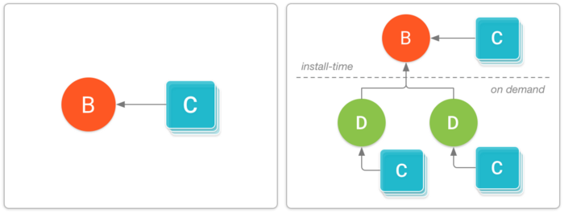
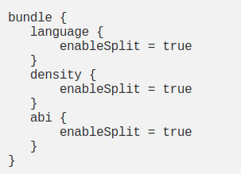

# app-bundles-dynamic-delivery-sample

# App Bundles

## Overview

* Tại Google I/O 2018, một định dạng publish app mới đã được giới thiệu cho các app Android có tên là **Android App Bundle(.aab)**. Đây là định sạng tải lên mới bao gồm tất cả các mã code và tài nguyên được biên dịch, nhưng trì hoãn việc tạo APK và signing vào Google Play. 

* Tại sao lại sử dụng định dạng mới này?

    * **Dynamic Delivery**: Mô hình phục vụ ứng dụng mới của Google Play được gọi là **Dynamic Delivery**, người dùng sử dụng app bundle để tạo và cung cấp APK được tối ưu hóa cho từng cấu hình thiết bị của người dùng. Vì vậy họ chỉ tải xuống code và tài nguyên họ cần để chạy ứng dụng của bạn.
    
    * **No need to manually manage multiple APKs**: Bạn không còn phải xây dựng, sign và quản lý nhiều APK để hỗ trợ các thiết bị khác nhau và người dùng có thể có được cá bản tải xuống nhỏ hơn, tối ưu hơn. Ví dụ bây giờ bạn không phải tạo nhiều APK cho các thiết bị có độ phân giải màn hình khác nhau.
    
    * **Dynamic Feature Module**: Các module này chứa các tính năng và tài sản mà bạn có thể quyết định không bao gồm khi người dùng lần đầu tải xuống và cài đặt app của bạn. Sử dụng thư viện **Play Core**, app của bạn sau đó có thể yêu cầu tải xuống các module đó dưới dạng **Dynamic feature APKs**.
    
    * **Reduces APK size**: Sử dụng cơ chế split apk, Google Play có thể chỉa 1 ứng dụng lớn thành các gói nhỏ hơn, riêng biệt được cài đặt trên thiết bị của người dùng theo yêu cầu. Trung bình các ứng dụng được xuấ tbarn với app bundles có kích thước nhỏ hơn 20%.
    
* Để build một app bundle: Bạn có thể dễ dàng build được đối với Android Studio phiên bản **3.2 Canary 14+** hoặc là sử dụng bằng command line

    * **Android Studio(Canary 14+)**: Bạn có thể vào **Build** -> **Build Bundle(s)/APK(s)**
    
    * **Console**: Bạn thực hiện chạy task **./gradlew bundle**
    
    > App bundle sẽ được sinh ra ở thư mục: **app/build/outputs/bundle/buildVariant/bundle.aab**.


### Android App bundle (.aab)

* Định dạng file mà khi sử dụng App Bundle trên Android Studio để triển khai APK tùy chỉnh cho người dùng sử dụng Dynamic Delivery của Google Play.

* Định dạng này sẽ được tải lên trên play store và nó sẽ tạo ra nhiều phiên bản ứng dụng khác nhau dựa trên chip, kích thước màn hình và địa phương. Apk tùy chỉnh sẽ có kích thước nhỏ hơn.

> Chúng ta có thể thực hiện những việc này bằng cách sử dụng split apk và tùy chỉnh 1 vài cấu hình trong gradle, nhưng nay play console sẽ tự động thực hiện các tác vụ này cho bạn. 

* Trong file .aab này bao gồm: 

    * **base/, feature1/, feature2/**: Thư mục cao nhất chứa các module của app. Thư mục chính này luôn chứa module chính của app của bạn, mỗi dynamic module 
    
    * **BUNDLE-METADATA/**: Metadata file có thể bao gồm Proguard mapping và danh sách các tệp DEX của ứng dụng. Thư mục này chỉ khả dụng khi proguard được bật.
    
    * **Module Protocol Buffer (*.pb) files**: Cung cấp metadata mô tả nội dung của từng module cho Play Store. Chẳng hạn BuildConfig.pb cung cấp thông tin về chính gói đó, giống như phiên bản nào của các công cụ xây dựng đã được sử dụng để build App Bundle.
    
    * **dex**: Chứa các tệp DEX cho mỗi module trong thư mục riêng.
    
    * **res, lib, and assets**: Các thư mục này sử dụng giống APK thông thường, ngoại trừ đối với App Bundle, chúng được Google Play sử dụng để chỉ gói các tệp thỏa mãn cấu hình thiết bị đích.
    
    * **root**: Các thư mục này lưu trữ các tệp mà sau đó được chuyển đến thư mục gốc của APK bao gồm module tương ứng.


## Dynamic Delivery System

* Thành phần cơ bản của Dynamic Delivery là cơ chế phân chia APK có sẵ trên Android 5.0 trở lên. Cơ chế này giống với các Apk thông thường bao gồm mã byte DEX được biên dịch, các resource của Android và tệp AndroidManifest.

* Tuy vậy nền tảng Android có thể chia nhỏ nhiều apk để cài đặt như 1 ứng dụng. Nghĩa là bạn cso thể cài đặt nhiều APK phân chia có quyền truy cập vào mã và tài nguyên chung và xuất hiện dưới dạng 1 ứng dụng được cài đặt trên thiết bị.




### Dynamic Delivery with split APKs

* **Base APK**: APK này chứa tất cả các mã và resource mà tất cả các split APK khác có thể truy cập và cung cấp chức năng cơ bản cho ứng dụng. Khi người dùng yêu cầu tải xuống ứng dụng của bạn, APK này sẽ được tải xuống và cài đặt trước. Điều đó bởi vì có tệp AndroidManifest của APK base khai báo đầy đủ các dịch vụ, ứng dụng cung cấp nội dung, quyền, yêu cầu về version và phụ thuộc vào các tính năng của hệ thống.


* **Configuration APKs**: Mỗi APK này bao gồm các thư viện và tài nguyên riêng cho từng loại màn hình, kiến trúc CPU hoặc ngôn ngữ cụ thể. Khi người dùng tài xuống ứng dụng của bạn, họ sẽ chỉ tải APK nhắm mục tiêu vào thiết bị của họ. Mỗi APK cấu hình là một phụ thuộc của **Base APK** hoặc là **Dynamic feature APKs**, chúng được tải xuống và cài đặt cùng với APK mà chúng cung cấp source và tài nguyên cho. Không giống như base hoặc dynamic feature, bạn không tạo 1 module riêng cho configuration apk. Nếu bạn sử dụng tiêu chuẩn để sắp xếp các tài nguyên thay thế, dành riêng cho cấu hình các module dynamic feature hoặc là base apk, Google Play sẽ tự tạo Configuration APK.
    

* **Dynamic feature APKs**: Mỗi APK này chưa mã và tài nguyên của 1 tính năng trong ứng dụng mà bạn module nó, thông qua dynamic, sau đó bạn có thể tùy chỉnh cách thức và thời điểm tải về trên thiết bị. Ví dụ 1 số ứng dụng phải truy cập vào module mới yêu cầu tải thêm dữ liệu của phần đó về.


> Đối với các device chạy Android 4.4 (API level 20) hoặc thấp hơn, Google Play tự động cung cấp 1 APK duy nhất mà tối ưu hóa cho cấu hình của thiết bị.

### Dynamic Feature Modules

* Dynamic feature module cho phép bạn tách các tính năng và tài nguyên nhất định ra khỏi module base và đưa chúng vào app bundle. Bạn có thể tùy chỉnh việc tải về các tài nguyên sau khi người dùng đã sử dụng app, làm giảm dung lượng tải cho Apk ban đầu.

#### Creating a dynamic feature module

* Để sử dụng tính năng này vào dự án sử dụng Android Studio (3.2 Canary 14+).
> Lưu ý trước đó bạn phải tạo app bundle.

1. Chọn **File > New > New Module** từ thanh menu. Trong hộp thoại hiện ra chọn **Dynamic Feature Module** rồi chọn **Next**.

2. Tiếp đến là điền tên và title của module bạn muốn tạo.
> Chọn **Enable on-demand** nếu bạn muốn module có sẵn để tải xuống theo yêu cầu. Check **Fusing** nếu như bạn muốn module này khả dụng cho những thiết bị từ Android 4.4 trở xuống và đưa nó vào nhiều APK.

3. Finish và đợi cho projecy tự sign.

#### Configuration file

1. BuildGradle

* Apply module vào file build.gradle

```
apply plugin: 'com.android.dynamic-feature'
```

* Những thứ không bao gồm như:

    * Signing configurations: App bundle sử dụng signing configuration của base module.
    * minifyEnabled property: Bạn có thể kích hoạt thu hẹp mã cho toàn bộ dự án khi cấu hình base module.
    * versionCode and versionName: Gradle sử dụng thông tin này của base module cung cấp.
    
* Khi dynamic module của bạn được tạo, nó sẽ được thêm vào thuộc tính **android.dynamicFeatures** của base module.

```
dynamicFeatures = [":dynamic_feature"]
```

* Ngoài ra, base module dependency sẽ được thêm vào dynamic module.

```
implementation project(':app')
```

2. AndroidManifest.xml

```
<manifest xmlns:dist="http://schemas.android.com/apk/distribution"
    package="com.example.dynamic_feature">

    <dist:module
        dist:instant="false"
        dist:onDemand="true"
        dist:title="@string/title_dynamic_feature">
        <dist:fusing dist:include="true" />
    </dist:module>
</manifest>
```

* **<dist:module**: Phần tử XML mới này xác định cách module được đóng gói và phân phối dưới dạng apk.
* **dist:onDemand="true|false"**: Chỉ định module có được tải xuống theo yêu cầu hay không.
* **dist:title="@string/feature_name"**: Chỉ title hướng tới người dùng module.
* **<dist:fusing include="true|false" />**: Chỉ định có bao gồm module trong nhiều apk nhắm tới các thiết bị chạy Android 4.4 trở xuống hay k.

> Nếu dynamic feature module không tự tạo file DEX, nghĩa là nó không chứa mã được biên dịch thành định dạng tệp DEX,bạn phải đặt thuộc tính này là false nếu không sẽ gặp lỗi khi runtime.

```
<application
  android:hasCode="true"
  tools:replace="android:hasCode">
  ...
</application>
```

#### Downloading dynamic feature modules

* Với thư viện Google Play Core, ứng dụng của bạn có thể tải xuống các dynamic feature module theo yêu cầu cho các thiết bị chạy Android 5.0 trở lên. Bạn cũng có thể sử dụng thư viện này để tải xuống các module hỗ trợ cho **Android Instant Apps**.
> Lưu ý: Downloading module theo yêu cầu đang là bản beta, nếu có vấn đề gì bạn nên report bug lại cho nhà phát triển.

* Thêm thư viện Play Core vào bên trong build.gradle của app bạn.

```
dependencies {
    implementation 'com.google.android.play:core:1.3.4'
}
```

**Request an on demand dynamic feature module:**

* Sử dụng **SplitInstallManager.startInstall()**: Ứng dụng của bạn cần ở trong foreground để gửi request. Khi ứng dụng của bạn request 1 module theo yêu cầu, thư viện Play Core sử dụng chiến lược **fire-and-forget** và quên đi theo kiểu không đồng bộ. Đó là nó sẽ gửi yêu cầu tải module xuống nền tảng nhưng nó không theo dõi xem việc cài đặt có thành công hay không, vì vậy bạn phải theo dõi trạng tháy yêu cầu.

```
fun requestModule(context: Context) {
        val splitInstallManager = SplitInstallManagerFactory.create(context)
        val request = SplitInstallRequest.newBuilder()
            .addModule("dynamic_feature")
            .build()

        splitInstallManager.startInstall(request)
            .addOnSuccessListener { sessionId ->
            }
            .addOnFailureListener { exception ->

            }
    }
```
> Để có quyền truy cập ngay vào module code hoặc tài nguyên, ứng dụng của bạn cần kích hoạt [SplitCompat](https://developer.android.com/guide/app-bundle/playcore#access_downloaded_modules)

* Sử dụng **SplitInstallManager.deferredInstall()**: Nếu bạn muốn trì hoãn cài đặt khi ứng dụng ở chế độ background. Yêu cầu cài đặt hoãn lại là việc tốt nhất cần làm và bạn không thể theo dõi tiến trình của nó. Vì vậy, trước khi thử truy cập 1 module bạn đã chỉ định cho cài đặt hoãn lại, bạn nên kiểm tra xem module đã được cài đặt hay chưa.

```
splitInstallManager.deferredInstall(Arrays.asList("dynamicModule"))
```

**Monitor the Request State of an on demand module:**

```
fun requestWithCallback(context: Context) {
        var mySessionId = 0

        val splitInstallManager = SplitInstallManagerFactory.create(context)

        val request = SplitInstallRequest
            .newBuilder()
            .addModule("dynamic-module")
            .build()

        val listener =
            SplitInstallStateUpdatedListener { splitInstallSessionState ->
                if (splitInstallSessionState.sessionId() == mySessionId) {
                    when (splitInstallSessionState.status()) {
                        SplitInstallSessionStatus.INSTALLED -> {
                            Log.d(TAG, "Dynamic Module downloaded")
                        }
                    }
                }
            }

        splitInstallManager.registerListener(listener)

        splitInstallManager.startInstall(request)
            .addOnFailureListener { e -> Log.d(TAG, "Exception: $e") }
            .addOnSuccessListener { sessionId -> mySessionId = sessionId }
    }
```
> Bạn có thể check xem các trạng thái trả về ở [đây](https://developer.android.com/guide/app-bundle/playcore)

**Managing dynamic feature modules:**

* Để hủy 1 request trước khi nó được cài đặt, bạn có thể sử dụng phương thức **cancelInstall()** và truyền vào sessionId.

```
splitInstallManager.cancelInstall(mySessionId)
```

* Để kiểm tra xem dynamic module đó đã được cài đặt hay chưa, sử dụng phương thức **getInstalledModules()**.

```
 val installedModule = SplitInstallManagerFactory.create(context).installedModules
```

* Để gỡ cài đặt 1 module, sử dụng phương thức **deferredUninstall(List<String> modules)**


### Test with Bundle Tool

* Bundletool là công cụ cơ bản mà Gradle, AndroidStudio và Google Play sử dụng để xây dựng gói Android App Bundle hoặc chuyển đổi các app bundle thành các APK khác nhau được triển khai cho các thiết bị.

* Để tạo 1 APK cho tất cả cấu hình thiết bị mà ứng dụng của bạn hỗ trợ từ app bundle, hãy sử dụng lệnh bundletool **build-apks**.

```
$ bundletool build-apks --bundle=<path to .aab> --output=<out.apks>
```

* Chỉ có 2 đối số được yêu cầu là đường dẫn đến tệp .aab và thư mục nơi các apks tạo ra được lưu trữ. Sau đó chạy lệnh build-apks sẽ ra được như sau:

```
WARNING: The APKs won't be signed and thus not installable unless you also pass a keystore via the flag --ks.
$ bundletool build-apks --bundle=/MyApp/my_app.aab --    output=/MyApp/my_app.apks
--ks=/MyApp/keystore.jks
--ks-pass=file:/MyApp/keystore.pwd
--ks-key-alias=MyKeyAlias
--key-pass=file:/MyApp/key.pwd
```

* Để triển khai ứng dụng của bạn tự file APK, sử dụng **install-apks** và chỉ định đường dẫn tới file apk.

```
bundletool install-apks --apks=/MyApp/my_app.apks
```

### Update your app using App Bundle.

* Có 2 các update ứng dụng của bạn sử dụng App Bundle như sau: 

    * Linh hoạt: Trải nghiệm người dùng cung cấp background download và cài đặt với giám sát các trạng thái. UX này phù hợp khi người dùng chấp nhận sử dụng ứng dụng trong khi tải xuống bản cập nhật. Ví dụ bạn muốn người dùng dùng thử 1 tính năng mới mà không quan trọng đến tính năng cốt lõi.
    
    

    * Ngay lập tức: Trải nghiệm người dùng cần phải cập nhật và khởi động lại ứng dụng để tiếp tục sử dụng. Sau khi người dùng chấp nhận cập nhật, Google sẽ xử lý việc cài đặt và khởi động lại.
    
    

#### Check for update availability

```
fun checkUpdateAvailable(context: Context) {
        // Creates instance of the manager.
        val appUpdateManager = AppUpdateManagerFactory.create(context)

        // Returns an intent object that you use to check for an update.
        val appUpdateInfoTask = appUpdateManager.appUpdateInfo

        // Checks that the platform will allow the specified type of update.
        appUpdateInfoTask.addOnSuccessListener { appUpdateInfo ->
            if (appUpdateInfo.updateAvailability() == UpdateAvailability.UPDATE_AVAILABLE
                // For a flexible update, use AppUpdateType.FLEXIBLE
                && appUpdateInfo.isUpdateTypeAllowed(AppUpdateType.IMMEDIATE)
            ) {
                // Request the update.
            }
        }
    }
```
> Kết quả chứa trạng thái sẵn có cập nhật. Nếu có bản cập nhật và bản cập nhật được cho phép, AppUpdateInfo được trả lại cũng chứa ý định cập nhật.

#### Start an update

* Sử dụng phương thức **AppUpdateManager.startUpdateFlowForResult()** để yêu cầu cập nhật, như hiển thị bên dưới. Tuy nhiên bạn cần chú ý tần suất bạn yêu cần cập nhật để tránh gây phiền nhiễu hoặc mệt mỏi cho người dùng.

```
appUpdateManager.startUpdateFlowForResult(
    // Pass the intent that is returned by 'getAppUpdateInfo()'.
    appUpdateInfo,
    // Or 'AppUpdateType.FLEXIBLE' for flexible updates.
    AppUpdateType.IMMEDIATE,
    // The current activity making the update request.
    this,
    // Include a request code to later monitor this update request.
    MY_REQUEST_CODE)
```

* Lấy ra callback trạng thái update thì chúng ta sử dụng phương thức **onActivityResult()**.

```
override fun onActivityResult(requestCode: Int, resultCode: Int, data: Intent) {
    if (requestCode == MY_REQUEST_CODE) {
        if (resultCode != RESULT_OK) {
            log("Update flow failed! Result code: $resultCode")
            // If the update is cancelled or fails,
            // you can request to start the update again.
        }
    }
}
```
> Có các trạng thái trả về khi cập nhật như **RESULT_OK**, **RESULT_CANCEL**, **ActivityResult.RESULT_IN_APP_UPDATE_FAILED**.

#### Handle a flexible update

* Handle trạng thái khi update sử dụng listener

```
// Create a listener to track request state updates.
val listener = { state ->
    // Show module progress, log state, or install the update.
}

// Before starting an update, register a listener for updates.
appUpdateManager.registerListener(listener)

// Start an update.

// When status updates are no longer needed, unregister the listener.
appUpdateManager.unregisterListener(listener)
```

* Khi trạng thái trả về **InstallStatus.DOWNLOADED**, bạn cần restart ứng dụng để cài đặt update. Không như việc cập nhật ngay lập tức, Google Play không kích hoạt khởi động lại ứng dụng cho bạn. Vì vậy nó khuyên rằng bạn nên sử dụng thông báo khi cài đặt xong.

```
override fun onStateUpdate(state: InstallState) {
    if (state.installStatus() == InstallStatus.DOWNLOADED) {
        // After the update is downloaded, show a notification
        // and request user confirmation to restart the app.
        popupSnackbarForCompleteUpdate()
    }
    ...
}

/* Displays the snackbar notification and call to action. */
fun popupSnackbarForCompleteUpdate() {
    Snackbar.make(
        findViewById(R.id.activity_main_layout),
        "An update has just been downloaded.",
        Snackbar.LENGTH_INDEFINITE
    ).apply {
        setAction("RESTART") { appUpdateManager.completeUpdate() }
        setActionTextColor(resources.getColor(R.color.snackbar_action_text_color))
        show()
    }
}
```

* Khi bạn gọi phương thức **appUpdateManager.completeUpdate()** ở foreground, nền tảng sẽ hiển thị giao diện người dùng toàn màn hình để khởi động lại ứng dụng bên trong background. Sau khi nền tảng cài đặt bản cập nhật, ứng dụng sẽ được khởi động lại vào main activity.

* Thay vào đó bạn gọi phương thức đó trong background, bản cập nhật được cài đặt âm thầm mà không ảnh hưởng đến giao diện người dùng. Nhưng khi người dùng đưa ứng dụng của bạn lên foreground, nó khuyên bạn xem là kiểm tra xem có đang chờ cài đặt không. Nếu trạng thái là DOWNLOADED thì hiển thị thông báo để người dùng tiến hành cài đặt.

```
// Checks that the update is not stalled during 'onResume()'.
// However, you should execute this check at all app entry points.
override fun onResume() {
    super.onResume()

    appUpdateManager
        .appUpdateInfo
        .addOnSuccessListener { appUpdateInfo ->
            ...
            // If the update is downloaded but not installed,
            // notify the user to complete the update.
            if (appUpdateInfo.installStatus() == InstallStatus.DOWNLOADED) {
                popupSnackbarForCompleteUpdate()
            }
        }
}
```

#### Handle an immediate update

* Nếu bạn thực hiện cài đặt ngay lập tức, nếu trong quá trình cài đặt xảy ra sự cố, bản cập nhật vẫn sẽ được cài đặt dưới nền mà không cần sự chấp nhận của người dùng nữa.

* Tuy nhiên ứng dụng của bạn trở lại foreground, ben nên xác nhận rằng bản cập nhật không bị đình trệ trong trạng thái **UpdateAvailability.DEVELOPER_TRIGGERED_UPDATE_IN_PROGRESS**. Nếu đang trong trạng thái này thì hãy cập nhật tiếp tục như hình bên dưới.

```
// Checks that the update is not stalled during 'onResume()'.
// However, you should execute this check at all entry points into the app.
override fun onResume() {
    super.onResume()

    appUpdateManager
        .appUpdateInfo
        .addOnSuccessListener { appUpdateInfo ->
            ...
            if (appUpdateInfo.updateAvailability()
                == UpdateAvailability.DEVELOPER_TRIGGERED_UPDATE_IN_PROGRESS
            ) {
                // If an in-app update is already running, resume the update.
                manager.startUpdateFlowForResult(
                    appUpdateInfo,
                    IMMEDIATE,
                    this,
                    MY_REQUEST_CODE
                );
            }
        }
}
```
